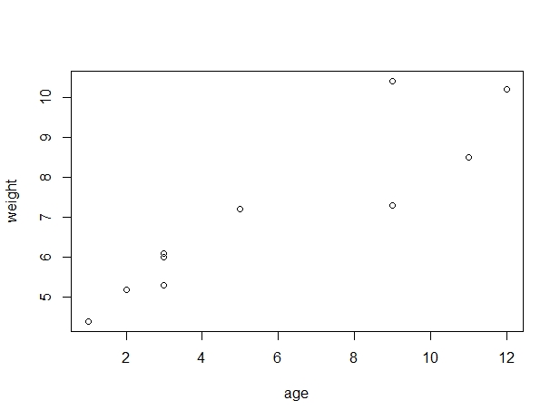

### Day1

#### 1词云代码

```R
library(wordcloud2)#调用wordcloud2包
wordcloud2(data=demoFreq, size=1.6)#括号中对调用的包进行参数设置
write.table(demoFreq, "Demo1.csv", sep = ",")#导出了表格数据
#根据导出表格数据，自定义生成自己的词云
demo<-read.table("10.28.scv",sep=",")#将自定义的数据值赋给demo变量
wordcloud2(data=demo, size=1.6, backgroundColor = "pink")#设置好各个参数，就可以运行了
```

* 总结
  * 包中内置数据生成.scv文档后，应另存新文档，避免再次导出数据时被覆盖。
  * 运行完代码后，如若右下角窗口没有显示完内容，应考虑将size调小。
  * 保存代码，再重新运行时，要记住第一步是==调用包==。
  * 当然，还可以进行一些个性化的设置。

#### 2阅读*R in Action*

##### 2.1 笔记

* R是一种区分大小写的解释型语言，R语句由函数和赋值构成。R使用<-，而不是传统的=作为赋值符号。
* 函数help.start()会打开一个浏览器窗口，我们可在其中查看入门和高级的帮助手册、常见问题。
* sink()函数是把结果输出到文件而不是R控制台。
* 数据框（data frame）是R中用于存储数据的一种结构，在同一个数据框中可以存储不同类型
  （如数值型、字符型）的变量。
* 函数attach()将数据框添加到R的搜索路径中；函数detach()将数据框从搜索路径中移除，不会对数据框本身做任何处理。
* 美元符号$与其他语言中的句点有类似的含义。

##### 2.2 应用

* 代码清单1-1

``` R 
age <- c(1,3,5,2,11,9,3,9,12,3)
weight <- c(4.4,5.3,7.2,5.2,8.5,7.3,6.0,10.4,10.2,6.1)
mean(weight)#[1]7.06
sd(weight)#[2.077498]
cor(age,weight)#[0.9075655]
plot(age,weight)
q()#得出婴儿体重（千克）和年龄（月）的散点图
```



* 代码清单2-4、2-5

``` R 
patientID <- c(1, 2, 3, 4)
age <- c(25, 34, 28, 52)
diabetes <- c("Type1", "Type2", "Type1", "Type1")
status <- c("Poor", "Improved", "Excellent", "Poor")
patientdata <- data.frame(patientID, age, diabetes, status)
patientdata
patientdata[1:2]
patientdata[c("diabetes", "status")]
patientdata$age
```


