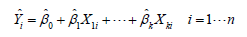

### Day 7

#### 8 回归

##### 8.2 OLS回归

1. OLS回归拟合模型的形式：

2. ``` R
   用lm()拟合回归模型
   myfit <- lm(formula, data)#formula指要拟合的模型形式，data是一个数据框。formula形式：Y ~ X1 + X2 + ... + Xk，~左边为响应变量，右边为各个预测变量。
   ```

3. 简单线性回归：回归模型包含一个因变量和一个自变量。多项式回归：只有一个预测变量，
   但同时包含变量的幂（比如，X、X2、X3）。多元线性回归：有不止一个预测变量。

4. *summary()* 展示拟合模型的详细结果
   *coefficients()* 列出拟合模型的模型参数（截距项和斜率）
   *confint()* 提供模型参数的置信区间（默认95%）
   *fitted()* 列出拟合模型的预测值
   *residuals()* 列出拟合模型的残差值
   *anova()* 生成一个拟合模型的方差分析表，或者比较两个或更多拟合模型的方差分析表
   *vcov()* 列出模型参数的协方差矩阵
   *AIC()*输出赤池信息统计量
   *plot()* 生成评价拟合模型的诊断图
   *predict()* 用拟合模型对新的数据集预测响应变量值

5. ``` R
   拟合含二次项的等式
   fit2 <- lm(weight ~ height + I(height^2), data=women)
   拟合三次多项式
   fit3 <- lm(weight ~ height + I(height^2) +I(height^3), data=women)
   ```

##### 8.3 回归诊断

``` R
回归诊断实用函数
qqPlot()#分位数比较图
durbinWatsonTest() #对误差自相关性做Durbin-Watson 检验
crPlots() #成分与残差图
ncvTest() #对非恒定的误差方差做得分检验
spreadLevelPlot() #分散水平检验
outlierTest() #Bonferroni 离群点检验
avPlots() #添加的变量图形
inluencePlot() #回归影响图
scatterplot() #增强的散点图
scatterplotMatrix() #增强的散点图矩阵
vif() #方差膨胀因子
```

##### 8.4 异常观测值

1. 离群点：那些模型预测效果不佳的观测点。*outlierTest()* 可以求得最大标准化残差绝对值*Bonferroni*调整后的p值。
2. 高杠杆值点：与其他预测变量有关的离群点。可通过帽子统计量（hat statistic）判断。
3. 强影响点：对模型参数估计值影响有些比例失衡的点。

##### 8.5 改进措施

1. 删除观测点：删除离群点通常可以提高数据集对于正态假设的拟合度，而强影响点会干扰结果，通常也会被删除。
2. 变量变换：当模型不符合正态性、线性或者同方差性假设时，一个或多个变量的变换通常可以改善或调整模型效果。powerTransform()函数通过λ的最大似然估计来正态化变量.
3. 增删变量，最常见的方法就是删除某个存在多重共线性的变量（某个变量根号vif >2）。

##### 8.6 选择“最佳”的回归模型

1. 模型比较。*anova*()函数可以比较两个嵌套模型的拟合优度。*AIC*()函数考虑了模型的统计拟合度以及用来拟合的参数数目。
2. 逐步回归：模型会一次添加或者删除一个变量，直到达到某个判停准则为止。*stepAIC*()
3. 全子集回归：所有可能的模型都会被检验。*regsubsets*()

##### 8.7 深层次分析

1. 交叉验证：即将一定比例的数据挑选出来作为训练样本，另外的样本作保留样本，先在训练样本上获取回归方程，然后在保留样本上做预测。
2. 相对重要性：*scale*()函数将数据标准化为均值为0、标准差为1的数据集，这样用R回归即可获得标准化的回归系数。*relweights*()计算预测变量的相对权重。